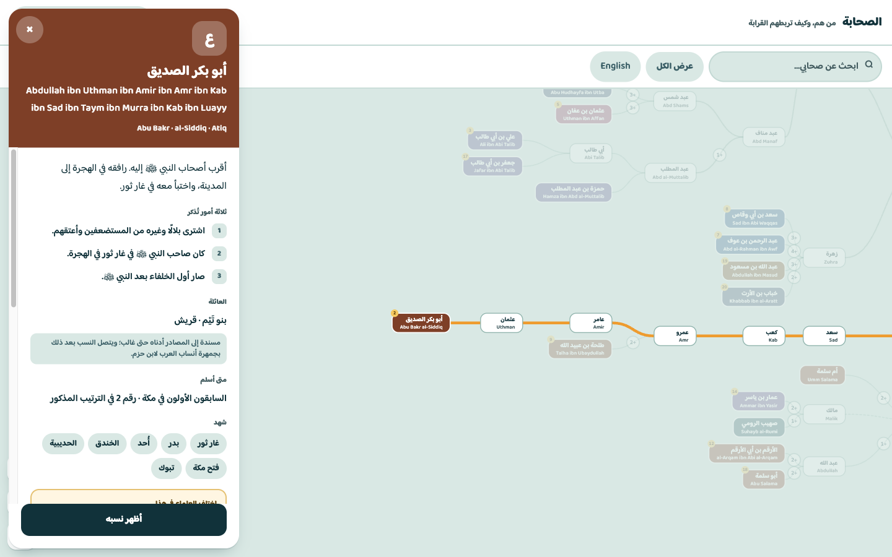
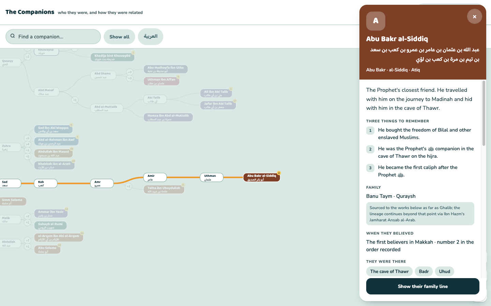

# The Companions

**العربية** · [English](#en)

---

<a id="ar"></a>

## العربية

[العربية](#ar) · [English](#en)

### الوصف

«الصحابة» شجرة نسبٍ وخطٌّ زمني تفاعليان وموثَّقان بالمصادر لصحابة النبي ﷺ، بالعربية والإنجليزية: من هم، وما صلات القرابة بينهم، ومتى ورد في المصادر أنّ كلًّا منهم آمن.

### لقطات الشاشة


*العرض الافتراضي للتطبيق: البحث عن أبي بكر الصديق يُبرز نسبه في الشجرة ويفتح بطاقته — قصته، وقرابته، ومتى ورد أنه آمن، ومصادره.*


*العرض نفسه بعد التحويل إلى الإنجليزية عبر مبدّل اللغة، وقد انتقلت الشجرة والبطاقة إلى الاتجاه من اليسار إلى اليمين.*

### المزايا

- شجرة نسبٍ تفاعلية وموثَّقة بالمصادر لصحابة النبي ﷺ
- خطٌّ زمني مرتَّب بحسب التاريخ الذي ورد فيه إيمان كل صحابي
- واجهة ثنائية اللغة (عربية/إنجليزية) بالكامل، مع دعم الاتجاه من اليمين إلى اليسار
- بطاقة تعريفية لكل شخص تُورد مصادره الخاصة به
- بحثٌ بالأسماء، بأيٍّ من اللغتين أو بالأسماء البديلة

### التطوير

```bash
npm install
npm run dev
```

ينتج الأمر `npm run build` مجلدًا ثابتًا باسم `dist/` (يُنشر على GitHub Pages عند الدفع إلى `main`)، بينما يقدّم `npm run preview` تلك النسخة محليًا.

### البنية

- `index.html` — الصفحة الرئيسية للمشروع.
- `sahaba-tree/index.html` — تطبيق شجرة نسب الصحابة وخطها الزمني.
- `src/sahaba-tree/` — وحدات JavaScript الخاصة بهذا التطبيق، وأنماطه، وبياناته.
  - `data/*.json` — مجموعة بيانات الصحابة (عُقد النسب، والأشخاص، والبطون، والأفواج، والمصادر، وسلاسل التوطين i18n، والإحصاءات المحسوبة مسبقًا)، مقسَّمة لتيسير تحريرها كلٌّ على حدة.
  - `data.js` / `model.js` — تحميل ملفات JSON واشتقاق مخطط النسب في الذاكرة.
  - `i18n.js`، `text-measure.js`، `collapse.js`، `layout.js` — منطق مساعد خالص.
  - `render.js`، `pan-zoom.js`، `card.js`، `interaction.js`، `search.js`، `timeline.js`، `tabs.js` — واجهة الشجرة والخط الزمني التفاعلية.
  - `main.js` — يربط ما سبق بعضه ببعض؛ وهو نقطة الدخول إلى الصفحة.
- `src/shared/` — الأنماط المشتركة بين الصفحات (الخطوط، وإعادة الضبط، وصفحة الهبوط).

### البيانات والمنهجية

#### مستويات الثقة في النسب

لكل صحابي حقل `genKind` يبيّن مدى توثيق نسبه:

- **موثَّق** — `Sourced` (شخصان) — النسب المعروض بكامله موثَّق فردًا فردًا إلى المصنفات المذكورة أدناه.
- **ممتد** — `Extended` (18 شخصًا) — موثَّق إلى جدٍّ مُسمّى، ثم يستكمل عبر العمود الفقري النسبي المعتمد في هذا التطبيق (المستمد أساسًا من «جمهرة أنساب العرب» لابن حزم).
- **تقريبي** — `Approximate` (29 شخصًا) — موضوع بحسب نسبته إلى بطنه أو قبيلته: إذ تُسمّي المصادر بطنه دون أن تحدد موضعه الدقيق فيه.

وهذا «العمود الفقري» ليس ملفًا مستقلًا، بل هو بنية مؤشّر الأب (`p`) المضمَّنة مباشرة في مدخلات `nodes.json` البالغة 234 مدخلًا، والمستمدة أساسًا من «جمهرة أنساب العرب» لابن حزم (انظر ثبت المصادر أدناه).

#### الاختلافات العلمية الموثَّقة

وهذا محورٌ مستقل تمامًا: فحقل `confidence` يصف مدى استقرار الخبر **الترجمي** (مثل: من أسلم أولًا)، لا موضع صاحبه في شجرة النسب. ومن بين 49 صحابيًا مُترجَمًا، جاء 44 منهم بوصف `attested` وخمسةٌ بوصف `disputed` بين أهل العلم. ويظهر ذلك في التطبيق مباشرةً: فعند فتح بطاقة صحابي مختلَف فيه تُعرض علامة «اختلف العلماء في هذا» (*Scholars recorded this differently*).

### ثبت المصادر

سبعة مصادر كلاسيكية لا غير — بعد إزالة التكرار من 142 إحالة موزَّعة على الصحابة الـ49 المترجَمين وعلى بيانات الأفواج — يرجع إليها كل ما في هذه الشجرة. وهي مرتَّبة زمنيًا بحسب سنة وفاة المؤلف المُحال إليه:

1. **السيرة النبوية** ("The Life of the Prophet") — محمد بن إسحاق (ت 150 هـ / 767 م)، برواية عبد الملك بن هشام (ت 213 هـ / 828 م).
   أقدم سيرةٍ متصلة للنبي ﷺ وصلت إلينا كاملة. وقد فُقد نص ابن إسحاق نفسه، فلم يبقَ إلا عبر تهذيب ابن هشام وروايته. والمرجع المعتمد هو طبعة القاهرة (تحقيق مصطفى السقا، وإبراهيم الأبياري، وعبد الحفيظ شلبي)، وأكثر ما يعتمده القارئ الإنجليزي ترجمة A. Guillaume الصادرة سنة 1955 بعنوان *The Life of Muhammad*.
   *يُحال إليه في تراجم 42 من أصل 49 صحابيًا · و4 أفواج.*

2. **الطبقات الكبرى** ("The Great Book of Generations") — محمد بن سعد (ت 230 هـ / 845 م).
   معجمٌ لتراجم النبي ﷺ والصحابة، مرتَّب بحسب الطبقة، ومرتَّب في مداخله المدنية على الأغلب بحسب القبيلة والبطن — وهو أقرب بناءٍ كلاسيكي إلى نموذج الأفواج المعتمد في هذا التطبيق. والمرجع المعتمد: طبعة دار صادر ببيروت.
   *المصدر الوحيد المُحال إليه في تراجم الصحابة الـ49 جميعًا، وفي كل فوجٍ من الأفواج.*

3. **الجامع الصحيح** ("صحيح البخاري") — محمد بن إسماعيل البخاري (ت 256 هـ / 870 م).
   أوثق مجاميع الحديث عند أهل السنة. ويتبع الترقيم المعتمد هنا ترقيم طبعة «فتح الباري»، وهو الشائع في المواقع الإلكترونية (مثل sunnah.com).
   *يُحال إليه في تراجم 21 صحابيًا · و4 أفواج.*

4. **الجامع الصحيح، كتاب فضائل أصحاب النبي ﷺ** — محمد بن إسماعيل البخاري (ت 256 هـ / 870 م).
   الكتاب المخصوص من «صحيح البخاري» في مناقب أعيان الصحابة — وهو المصدر المباشر لكثير من أخبار الفضائل الواردة في هذه البيانات.
   *يُحال إليه في ترجمة أبي بكر الصديق وحده · وفوجٍ واحد — وهو أضيق المصادر حضورًا هنا.*

5. **المسند الصحيح** ("صحيح مسلم") — مسلم بن الحجاج النيسابوري (ت 261 هـ / 875 م).
   ثاني أوثق مجاميع الحديث عند أهل السنة بعد البخاري.
   *يُحال إليه في ترجمة أبي ذر الغفاري وحده · وفوجٍ واحد.*

6. **جمهرة أنساب العرب** ("The Compendium of Arab Genealogies") — علي بن أحمد بن حزم الأندلسي (ت 456 هـ / 1064 م).
   المرجع الكلاسيكي المعتمد في أنساب العرب وقبائلها، وهو مصدر العمود الفقري النسبي في هذا التطبيق. وحيثما كانت صلةٌ في الشجرة مأخوذة من هذا العمود لا من المصادر الخاصة بالشخص نفسه، نصّت بياناته على ذلك صراحةً عبر الحقل `genKind`.
   *لا يُحال إليه مباشرةً ضمن المصادر الخاصة بأي صحابي بعينه، غير أنه مصدر العمود الفقري النسبي، ويُذكر صراحةً في حواشي النسب لدى الصحابة الـ18 المصنَّفين في مستوى «ممتد».*

7. **الإصابة في تمييز الصحابة** ("Fair Judgment in Distinguishing the Companions") — أحمد بن علي بن حجر العسقلاني (ت 852 هـ / 1449 م).
   أجمع المعاجم الكلاسيكية لتراجم الصحابة، وفيه نحو 12,300 ترجمة، استوعب فيه مصنفات هذا الفن السابقة كلها وقابل بينها. ويقسّم تراجمه إلى أربعة أقسام بحسب قوة الدليل على ثبوت الصحبة — وهي السابقة الكلاسيكية التي يستلهمها في روحه حقل `confidence` في هذا التطبيق.
   *يُحال إليه في تراجم 11 صحابيًا · وفوجين.*

### إمكانية الوصول

ضُبطت لوحة ألوان البطون المكوَّنة من 14 لونًا (وتتكرر دوريًا على 29 بطنًا وقبيلة في الشجرة) بحيث يحقق كل لونٍ منها نسبة تباين لا تقل عن **7:1 مع النص الأبيض** — أي المستوى AAA من معيار WCAG للنص بالحجم العادي؛ وأدنى قياسٍ مسجَّل **7.14:1**. أما نص المتن على خلفية الصفحة البيضاء فجاء كالآتي: `--ink` بنسبة **13.63:1**، و`--ink-soft` بنسبة **7.06:1**، و`--muted` بنسبة **7.04:1** — وكلها تبلغ المستوى AAA أو تتجاوزه. ويتضمن التطبيق كذلك رابط تخطٍّ إلى المحتوى الرئيسي، وأدوار ARIA (`combobox`/`listbox`/`dialog`/`status`)، وإمكانية تشغيلٍ كاملة عبر لوحة المفاتيح، ومؤشر تركيز مرئيًا (`:focus-visible`)، ودعم تفضيل تقليل الحركة (`prefers-reduced-motion`).

### شكر وتنويه

الخطوط مُتاحة عبر Google Fonts، وكلاهما مرخَّص برخصة الخطوط المفتوحة (OFL): [Baloo Bhaijaan 2](https://fonts.google.com/specimen/Baloo+Bhaijaan+2) (العناوين وجميع النصوص العربية) و[Nunito](https://fonts.google.com/specimen/Nunito) (المتن وواجهة الاستخدام في الإنجليزية).

### الترخيص

**الشِّفرة.** جميع الشِّفرات في هذا المستودع مرخَّصة بموجب [رخصة MIT](./LICENSE).

**مجموعة البيانات.** مجموعة البيانات المنسَّقة في `src/sahaba-tree/data/` — باختيارها وبنيتها ونصوصها العربية والإنجليزية — تجميعٌ أصلي لوقائع مستمدة من المصادر الكلاسيكية المذكورة أعلاه، وهي مُصدَرة كذلك بموجب رخصة MIT. ولا يمتد هذا الترخيص إلى الوقائع التاريخية نفسها ولا إلى المصنفات الكلاسيكية المأخوذة عنها، ولا يقيّد استخدامها.

**المصادر الكلاسيكية.** المصنفات السبعة الواردة في ثبت المصادر تراثٌ علمي، يرجع أكثره إلى قرونٍ خلت؛ فهي ليست مملوكة لهذا المشروع ولا مرخَّصة له ولا يدّعي فيها حقًّا، وإنما تُذكر للإحالة والاستزادة. وقد تكون للطبعات أو الترجمات الحديثة المسمّاة في الحواشي حقوقٌ خاصة بها؛ وهذا المشروع لا يعيد نشر نصوصها، وإنما يحيل إليها ببليوغرافيًا فحسب.

---

<a id="en"></a>

## English

[العربية](#ar) · **English**

### Description

The Companions is an interactive, sourced family tree and timeline of the Prophet's ﷺ Companions, in Arabic and English: who they were, how they were related, and when each is recorded as having believed.

### Screenshots


*The app's default view: searching for Abu Bakr al-Siddiq highlights his lineage in the tree and opens his card — his story, his relatives, when he is recorded as having believed, and his sources.*


*The same view after switching to English via the language toggle; tree and card flip to left-to-right.*

### Features

- An interactive, sourced family tree of the Prophet's ﷺ Companions
- A timeline ordered by when each companion is recorded as having believed
- A fully bilingual Arabic/English interface, with right-to-left support
- A per-person card citing that companion's own sources
- Name search, in either language or by alternate names

### Development

```bash
npm install
npm run dev
```

`npm run build` produces a static `dist/` (deployed to GitHub Pages on push to `main`); `npm run preview` serves that build locally.

### Structure

- `index.html` — the landing page.
- `sahaba-tree/index.html` — the Companions family tree/timeline app.
- `src/sahaba-tree/` — that app's JS modules, styles, and data.
  - `data/*.json` — the Sahaba dataset (genealogy nodes, people, clans, cohorts, sources, i18n strings, precomputed stats), split out for independent editing.
  - `data.js` / `model.js` — load the JSON and derive the in-memory genealogy graph.
  - `i18n.js`, `text-measure.js`, `collapse.js`, `layout.js` — supporting pure logic.
  - `render.js`, `pan-zoom.js`, `card.js`, `interaction.js`, `search.js`, `timeline.js`, `tabs.js` — the interactive tree/timeline UI.
  - `main.js` — wires the above together; the page's entry point.
- `src/shared/` — styles shared across pages (fonts, reset, landing page).

### Data & Methodology

#### Genealogical Confidence Tiers

Every companion has a `genKind` field describing how well-sourced their lineage is:

- **Sourced** (2 people) — the full lineage shown is individually sourced to the works below.
- **Extended** (18 people) — sourced back to a named ancestor, then continues via this app's genealogical backbone (drawn primarily from Ibn Hazm's *Jamharat Ansab al-Arab*).
- **Approximate** (29 people) — placed by clan/tribe attribution: the sources name their clan, but not their exact position within it.

That "backbone" isn't a separate file — it's the parent-pointer (`p`) structure baked directly into all 234 entries of `nodes.json`, primarily sourced from Ibn Hazm's *Jamharat Ansab al-Arab* (see Bibliography below).

#### Documented Scholarly Disputes

A separate axis entirely: the `confidence` field describes how settled a **biographical** claim is (e.g. who believed first), not genealogical placement. Of the 49 profiled companions, 44 are `attested` and 5 are `disputed` among scholars. This surfaces directly in the app — opening a disputed companion's card shows a "Scholars recorded this differently" flag.

### Bibliography

Everything in this tree traces back to exactly seven classical sources, deduplicated from 142 citations across all 49 profiled companions and the cohort data. Ordered chronologically by the cited author's death date:

1. **al-Sira al-Nabawiyya** ("The Life of the Prophet") — Muhammad ibn Ishaq (d. 150 AH / 767 CE), in the recension of Abd al-Malik ibn Hisham (d. 213 AH / 828 CE).
   The earliest connected biography of the Prophet ﷺ to survive in full. Ibn Ishaq's own text is lost; it survives through Ibn Hisham's edited recension. The standard reference is the Cairo edition (Mustafa al-Saqa, Ibrahim al-Abyari, Abd al-Hafiz Shalabi, eds.); English readers commonly use A. Guillaume's 1955 translation, *The Life of Muhammad*.
   *Cited by 42 of 49 profiled companions · 4 cohorts.*

2. **al-Tabaqat al-Kubra** ("The Great Book of Generations") — Muhammad ibn Sa'd (d. 230 AH / 845 CE).
   A biographical dictionary of the Prophet ﷺ and the Companions, organized by generation (*tabaqa*) and, within Madinan entries, largely by tribe and clan — the closest classical structure to the cohort model this app uses. Standard reference: the Beirut, Dar Sadir edition.
   *The one source cited for every single one of the 49 profiled companions, and every cohort.*

3. **al-Jami al-Sahih** ("Sahih al-Bukhari") — Muhammad ibn Ismail al-Bukhari (d. 256 AH / 870 CE).
   The most authoritative hadith collection in Sunni Islam. Standard reference numbering follows the Fath al-Bari edition/numbering, widely mirrored online (e.g. sunnah.com).
   *Cited by 21 companions · 4 cohorts.*

4. **al-Jami al-Sahih, Book of the Virtues of the Companions of the Prophet ﷺ** — Muhammad ibn Ismail al-Bukhari (d. 256 AH / 870 CE).
   The specific book (*kitab*) within Sahih al-Bukhari devoted to the merits of individual companions — the direct source for many of the *fadail*-style facts in this dataset.
   *Cited by Abu Bakr al-Siddiq alone · 1 cohort — the narrowest-footprint source here.*

5. **al-Musnad al-Sahih** ("Sahih Muslim") — Muslim ibn al-Hajjaj al-Naysaburi (d. 261 AH / 875 CE).
   The second most authoritative Sunni hadith collection after Bukhari.
   *Cited by Abu Dharr al-Ghifari alone · 1 cohort.*

6. **Jamharat Ansab al-Arab** ("The Compendium of Arab Genealogies") — Ali ibn Ahmad ibn Hazm al-Andalusi (d. 456 AH / 1064 CE).
   The standard classical reference for Arab tribal genealogy, and the source for this app's genealogical backbone. Where an edge in the tree comes from this backbone rather than a person's own cited sources, the person's data says so explicitly (`genKind`).
   *Not cited directly in any individual companion's own sources, but the backbone source, and named directly in the lineage notes of the 18 "Extended"-tier companions.*

7. **al-Isaba fi Tamyiz al-Sahaba** ("Fair Judgment in Distinguishing the Companions") — Ahmad ibn Ali ibn Hajar al-Asqalani (d. 852 AH / 1449 CE).
   The most comprehensive classical biographical dictionary of the Companions, roughly 12,300 entries, absorbing and cross-checking every earlier work in the genre. Sorts entries into four classes by strength of evidence for actual companionship — the classical precedent this app's own `confidence` field draws on in spirit.
   *Cited by 11 companions · 2 cohorts.*

### Accessibility

The 14-color clan palette (cycled across the tree's 29 clans/tribes) was tuned so every swatch clears **7:1 contrast against white text** — WCAG AAA for normal-size text; worst case measured **7.14:1**. Body text against the page's white background: `--ink` **13.63:1**, `--ink-soft` **7.06:1**, `--muted` **7.04:1** — all meeting or exceeding AAA. A skip link, ARIA roles (`combobox`/`listbox`/`dialog`/`status`), full keyboard operability, visible focus (`:focus-visible`), and `prefers-reduced-motion` support are also built in.

### Credits

Typefaces via Google Fonts, both OFL-licensed: [Baloo Bhaijaan 2](https://fonts.google.com/specimen/Baloo+Bhaijaan+2) (headings, all Arabic text) and [Nunito](https://fonts.google.com/specimen/Nunito) (body/UI, English).

### License

**Code.** All code in this repository is licensed under the [MIT License](./LICENSE).

**Dataset.** The curated dataset in `src/sahaba-tree/data/` — its selection, structure, and English/Arabic prose — is an original compilation of facts drawn from the classical sources above, and is likewise released under the MIT License. This does not extend to, or restrict use of, the underlying historical facts or the classical works they come from.

**Classical sources.** The seven works in the Bibliography are historical scholarship, most many centuries old; they are not owned, licensed, or claimed by this project and are listed for attribution and further reading only. Specific modern editions or translations named in the notes may carry their own separate rights; this project doesn't reproduce their text, only cites them bibliographically.
